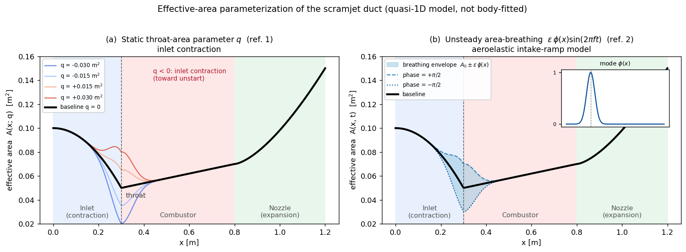
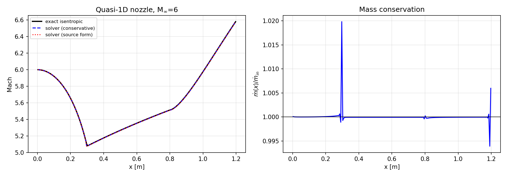
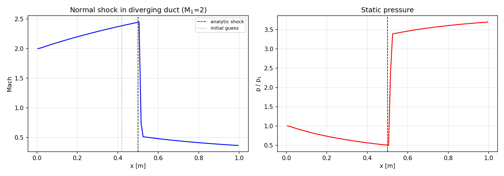
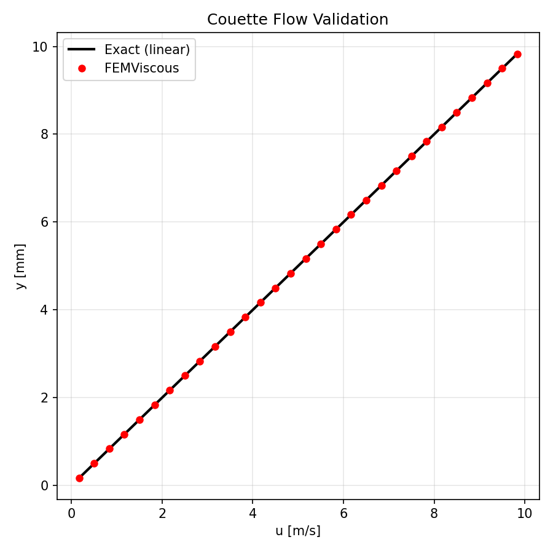
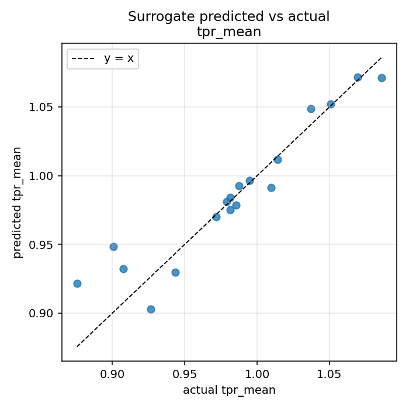
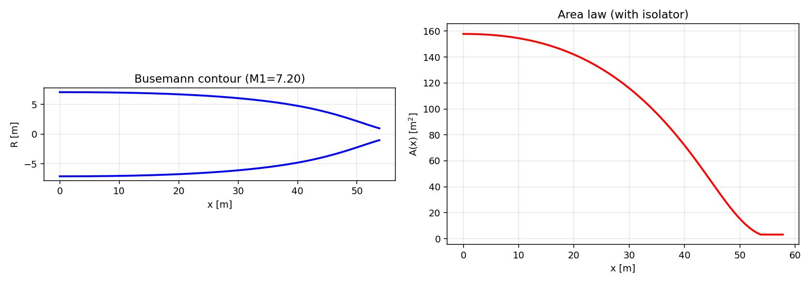

# Scramjet Unstart and Wall Motion Study

## Overview

The implementation decisions, quantified old/new reassessment, hypothesis
positioning, and remaining Paper-1 critical path are recorded in
[`RESEARCH_REPORT.md`](RESEARCH_REPORT.md).

A **scramjet** (supersonic combustion ramjet) is an air-breathing engine for
sustained flight above roughly Mach 5. It carries no rotating compressor: at
hypersonic speed the inlet geometry alone compresses and decelerates the
captured air, which is then mixed with fuel and burned in a still-supersonic
stream to produce thrust. Because the inlet performs the compression that a
turbomachine would otherwise supply, the engine operates only while the inlet is
*started*, delivering a steady, high-pressure flow to the combustor.

Two phenomena threaten that condition. **Unstart** occurs when excess internal
contraction or combustor back-pressure forces the shock train out of the duct:
mass capture collapses, and inlet pressure recovery, thrust, and flame-holding
collapse with it. **Aeroelastic deformation** arises because the compression
surfaces are thin, hot, and structurally loaded, so they deflect and oscillate
in flight and continuously perturb the geometry that fixes the compression.

This project studies both phenomena in a hypersonic scramjet duct, combining a
compressible-flow model of the inlet/isolator/combustor/nozzle with the
experimental geometries of Schram and Narayanaswamy [1] (streamtraced/Busemann
inlet unstart at angle of attack) and Bhattrai et al. [2] (aeroelastic response
of a compression-ramp intake), as well as general parametrized geometries:
sweeping the static wall position spans a family of inlet contractions, and
varying the oscillatory wall motion spans a family of unsteady regimes.
High-fidelity, body-fitted simulations are planned in OpenFOAM; no exported
case has yet been meshed, run, and postprocessed in this repository. The model
here resolves the quasi-1D compressible dynamics and the geometry and
forcing parameter space that frame those simulations.

## Research direction

Two coupled questions drive the work.

1. **Inlet-contraction sensitivity and the approach to unstart.** How does a
   change in throat area or wall position shift the duct performance
   (total-pressure recovery, shock position, exit Mach), and how much
   contraction can the duct sustain before the started solution is lost? This
   is the reduced-order counterpart of the inlet-unstart behavior measured for
   streamtraced and Busemann-type intakes at non-zero angle of attack [1],
   where unstart is governed by shock-train motion, isolator margin, and
   large-scale separation [3].

2. **Aeroelastic-intake response to a moving wall.** How does a small, periodic
   oscillation of the throat area drive the unsteady duct response, how large is
   that response, and how far does it lag the wall motion? This represents the
   aeroelastic deformation of a hypersonic intake ramp measured experimentally
   in [2], where ramp deflection correlated directly with isolator
   total-pressure loss, and connects to the broader hypersonic
   aerothermoelasticity literature [4].

Mapping a wide parameter space with the full model would be expensive, so two
reduced representations carry most of the load: a proper-orthogonal-
decomposition (POD) reconstruction [5], a full-fidelity GP with ROM
prescreening, and a response surrogate [6], framed as **adaptive sampling**: they
concentrate the costly, body-fitted OpenFOAM cases on the configurations the
study flags as significant.

> **Geometries of interest.** The streamtraced/Busemann inlet of [1] and the
> cantilevered compression-ramp intake of [2] are the initial reference
> geometries. They enter the model through their effective-area signatures: a
> static contraction parameter `q` and a localized breathing mode
> `eps * phi(x)`. These signatures are general. Sweeping `q` defines a family of
> inlet wall positions, and varying the breathing amplitude, frequency, and
> phase defines a family of wall-motion regimes. A parametric **Busemann
> generator** (`busemann.py`, Taylor–Maccoll integration) produces the Config-B
> geometry family directly, and experiment-condition presets (`configs/`)
> replace the generic atmosphere baseline with tunnel freestream conditions.
> Any selected configuration is reconstructed body-fitted in OpenFOAM, for
> which the exporter emits the geometry, freestream state, a structured Gmsh
> mesh definition, and an OpenFOAM case template with shared QoI definitions.



*The two geometry controls in the effective-area model. (a) a static throat-area
parameter `q`, where `q < 0` contracts the inlet toward unstart, matching the
study geometry of [1]; (b) an unsteady area-breathing mode
`eps * phi(x) * sin(2 pi f t)`, a reduced representation of intake-ramp
aeroelasticity [2]. The model uses a quasi-1D area law, not a body-fitted wall.*

## Motivation

Because the compression is set entirely by the duct geometry and the shock
system it supports, a scramjet inlet is unusually sensitive to small changes in
that geometry. A modest change in throat area, whether a design choice or an
in-flight deformation of a compression surface, can move the shock train, erode
the margin against unstart, and, past a limit, collapse the inlet [3]. The
surfaces that hold this geometry are simultaneously primary load paths and heat
sinks, so under aerothermal load they deflect and oscillate, feeding the
structural response back into the aerodynamics [2, 4]. The two effects are
coupled: contraction sets how close the inlet runs to its unstart limit, and
wall motion modulates that margin in time.

Resolving these phenomena directly requires body-fitted, turbulent, and
eventually moving-mesh CFD, which is costly enough that sweeping geometry and
forcing parameters by brute force is impractical. A reduced-order compressible
model that captures the leading-order area dynamics can map the parameter space
first, locate the regimes worth resolving, and supply consistent geometry and
run conditions to the high-fidelity solver.

## Theory

The duct flow is modeled by the two-dimensional compressible conservation laws
with a quasi-1D variable-area coupling, written for the conservative state
`U = [rho, rho u, rho v, rho E, rho Y_f]` in the area-weighted form

```math
\partial_t (A U) + \partial_x (A F(U)) + A\,\partial_y G(U)
= S_{\text{geo}} + A\,S_{\text{chem}}
+ A\,\nabla \cdot (\mu \nabla u,\; k \nabla T,\; \rho D \nabla Y_f),
```

```math
S_{\text{geo}} = p\,\partial_x A\,[0,\,1,\,0,\,0,\,0]^\top
\;-\; \partial_t A\,[\rho,\,\rho u,\,\rho v,\,\rho E+p,\,\rho Y_f]^\top .
```

The pressure–area force `p ∂A/∂x` is the only geometric source the
area-weighted momentum equation carries; dividing through by `A` shows the
equivalent plain-state form carries geometric sources in **every** equation,
`S = -(A'/A)\,u\,[\rho,\ \rho u,\ \rho v,\ \rho E + p,\ \rho Y_f]`. Both forms
are implemented (the conservative form is the solver's primary path; the
source-vector form is kept as an independent cross-check, and a validation test
holds the two in agreement). The `∂A/∂t` term is the quasi-1D moving-control-
volume source. Its energy row contains wall-pressure work `-p A_t/A`: a
uniform static gas therefore follows `rho ∝ A^-1`, `p ∝ A^-gamma`, and
`T ∝ A^-(gamma-1)`. Omitting that work gives the wrong isothermal-like
`p ∝ A^-1` response. The `legacy_breathing_energy` switch exists only for
before/after audits and must not be used for research results.

For a supersonic stream this coupling reproduces the area–Mach behavior that
governs the inlet: a decreasing area (`dA/dx < 0`) **decelerates and
compresses** the flow, an increasing area accelerates and expands it, and the
discrete formulation conserves the duct mass flow `rho u A` and, for smooth
flow, the total pressure (see the validation section). The inlet contraction
therefore sets the compression delivered to the isolator, and there is a
contraction limit beyond which a started, fully supersonic solution no longer
exists and the inlet unstarts, expelling the shock system upstream [3].

The duct geometry is a three-section area law `A_base(x)` (a contracting inlet,
a slightly diverging combustor, and an expanding nozzle); tabulated area laws
(`TabulatedAreaProfile`) admit experiment-derived geometries — a Config-A-like
ramp/isolator turning schedule and Busemann-generated contours — through the
same interface. The two research controls are localized perturbations of the
law about the throat, using a Gaussian shape `phi(x)`:

```math
A(x; q) = A_{\text{base}}(x) + q\,\phi(x), \qquad
\phi(x) = \exp\!\left[-\tfrac{1}{2}\left(\tfrac{x - x_{\text{throat}}}{\sigma}\right)^{2}\right],
```

```math
A(x, t) = A_{\text{base}}(x) + \big(q_{\text{offset}} + \varepsilon \sin(2\pi f t + \psi)\big)\,\phi(x).
```

The static parameter `q` represents an effective throat-area or wall-position
change and is the axis for the contraction and unstart study. The time-periodic
mode is a reduced representation of a compression surface oscillating under
aerothermoelastic load; its response amplitude and its phase lag relative to
the wall motion quantify the aeroelastic coupling reported in [2].

A second forcing axis drives the duct from downstream: a **back-pressure
outlet** (static or sinusoidally modulated) supports and forces normal-shock /
shock-train motion, the mechanism of combustor-driven unstart and the
configuration of the classical forced-shock response literature (Culick &
Rogers; Sajben's transonic-diffuser experiments) used to verify the unsteady
response pipeline.

## Research core and quantities of interest

The **research core** (Paper-1 toolchain) is the cold-flow effective-area
model, the two forcing axes (`q`, breathing mode; back pressure), the
experiment-matched QoIs, the response-metric extraction, and the adaptive
sampling / export machinery. The primary QoIs are the quantities the anchor
experiments measure:

- `tpr` — total-pressure recovery: mass-flux-weighted exit stagnation pressure
  over the freestream stagnation pressure;
- `shock_x` — dominant shock location, detected by local total-pressure
  destruction (smooth isentropic compression conserves `p0`; shocks do not)
  and refined by the sonic crossing;
- wall/probe pressures, response amplitude, and phase lag (wrapped to
  `(-pi, pi]`) from `response_metrics.py`. Positive lag means the response is
  delayed relative to the forcing. Each signal is fitted against its own
  timestamps with a drift term; amplitude and phase are admitted only when
  cycle/sample/aliasing guards pass. R², residual RMS, drift fraction, and
  signal-to-residual ratio are recorded.

The supersonic inlet is Dirichlet, so inlet flow is named
`mdot_prescribed`; it cannot reproduce spillage or mass-capture collapse.
`mdot_exit` and `mass_defect` diagnose conservation. Unstart is observable at
trend level through shock expulsion toward the inlet and TPR collapse. A
spillage-capable inlet boundary or external-flow coupling remains future work.

**Extended capabilities** kept compiled-in but outside the paper scope:
thrust/Isp engine QoIs (the legacy `pressure_recovery` output is the *static*
ratio `p_exit/p_inf`, retained for continuity), single-step Arrhenius
chemistry and the prescribed heat-release source, and the FEM-style implicit
diffusion operator. Cold flow is the default everywhere.

## Model and methods

The convective fluxes use an HLLC approximate Riemann solver on
MUSCL-reconstructed states — one van Albada/Venkatakrishnan-limited slope per
cell, with the limiter smoothing scaled per variable by the solution magnitude
so density, momentum, and energy are limited consistently — advanced in time
by a third-order strong-stability-preserving Runge–Kutta scheme whose stage
times are passed to the boundary conditions and geometry so time-dependent
forcing is stage-accurate. The x-direction fluxes are weighted by the duct
area at faces, which makes the steady mass flow telescope exactly and renders
a stagnant uniform-pressure state an exact discrete equilibrium
(well-balanced). Flux assembly is JIT-compiled (numba), giving ~50–70x faster
residual evaluations than the original Python loops; the Mach 6 baseline below
runs in about 2 s. An optional implicit FEM-style diffusion step for velocity,
temperature, and fuel fraction is applied by Strang operator splitting.
Unsteady cases march in physical time from a converged steady baseline and
record probe histories at the inlet, throat, combustor, and exit.

The compressible model is paired with two reduced representations:

- A **coefficient-interpolated POD reduced-order model** over the geometry axis. Converged snapshots at
  several `q` (and, optionally, exit area, nozzle length, and combustor length)
  are assembled into a snapshot matrix, truncated by SVD at a cumulative-energy
  threshold, and interpolated in coefficient space. Primary QoIs are computed
  from the reconstructed conservative state; direct IDW interpolation of the
  training QoIs is retained only as a comparison baseline. This is not a
  Galerkin/DEIM or time-accurate ROM.
- A **GP adaptive-sampling loop with ROM prescreening**, plus a response
  surrogate. The GP is trained on full-solver evaluations only. Expected
  Improvement ranks a candidate pool, the POD ROM screens the top `m`, and one
  selected point is confirmed by the full solver; the returned best point is
  full-verified by construction. The unsteady design of experiments over
  `(q_offset, eps, f, phase)` is
  summarized by a scalar response surrogate, with ridge-regression and
  inverse-distance fallbacks when samples are scarce.

Candidate configurations are ranked by a transparent weighted score over
normalized quantities of interest, and the selected geometries are exported
for OpenFOAM and FUN3D as an area profile, a wall contour, freestream and
derived stagnation conditions, shared quantity-of-interest definitions, a
structured **Gmsh** mesh definition (`.geo`, transfinite quads, named physical
groups), and an **OpenFOAM case template** (`rhoCentralFoam`-style `0/`,
`constant/`, `system/`, and a `pipefail`-safe `Allrun.sh` driver), sampling
function objects, and an executable `postprocess_qoi.py` that writes the shared
schema-v2 TPR/shock QoIs. This is designed for apples-to-apples comparison;
the loop is not yet closed. Review the dictionaries against the pinned
OpenFOAM version before production runs.

**Scope.** The model resolves inviscid, quasi-1D compressible duct dynamics
with the variable-area coupling, plus optional molecular diffusion and
reduced-order heat sources. Effects that require a body-fitted, turbulent, or
moving-mesh treatment — resolved boundary layers and shock/boundary-layer
interaction, turbulent separation, wall heat transfer, body-fitted moving-wall
kinematics, angle-of-attack three-dimensionality, and finite-rate chemistry —
will be computed in high-fidelity OpenFOAM cases. The reduced-order results
are read as trends and as a guide to where those cases are needed.

## Validation

> **July 2026 correction.** An earlier revision of this model applied the
> quasi-1D area source to the momentum equation only, which produces the
> mirror image of the correct supersonic area–Mach behavior (acceleration
> through the contraction) and does not conserve duct mass flow. The
> formulation was replaced (see Theory), the reconstruction and limiter were
> reworked, and the validation suite below now pins the variable-area physics
> against exact solutions. Parameter-study outputs generated before this
> correction are not physically meaningful and have been regenerated.

> **Breathing-energy correction (2026-07-12).** A second audit found that the
> time-dependent area source used `-(A_t/A) rhoE` instead of
> `-(A_t/A)(rhoE+p)`. All unsteady artifacts from before schema version 2 are
> invalid. The breathing test now distinguishes the corrected isentropic law
> from the legacy result, while a bitwise `A_t=0` check proves the forced-shock
> path is unaffected.

The validation groups pin down the numerics with exact or analytic
references (`python3 tests.py`):

| Test | Measured | Threshold | Reference |
|---|---|---|---|
| Sod shock tube, density / velocity / pressure (L1) | 0.0038 / 0.0069 / 0.0029 | 0.020 / 0.035 / 0.015 | exact Riemann solution |
| Quasi-1D nozzle, centerline Mach (mean / max dev.) | 0.02% / 0.5% | 0.5% / 2% | exact isentropic area–Mach |
| Quasi-1D nozzle, mass-flow and total-pressure drift | <1% each | 1% | exact conservation |
| Shock position under back pressure | within 1 cell | 3 cells | exact normal-shock-in-duct solution |
| Shock total-pressure ratio | 0.5170 | ±0.02 | 0.5168 exact |
| Couette flow, `u(y)` (L2, `FEMViscous` operator) | <0.1% | 5% of U_wall | analytic linear profile |
| Transient Couette start-up | 0.06% L2 | 2% | Fourier-series solution |
| Density/diffusion timescale scaling | machine agreement | 0.02% | timescale ∝ rho/mu |
| Breathing static-gas law | ~1e-15 relative | 2e-9 | `rho∝A^-1`, `p∝A^-gamma` |
| Combustion energy closure | 1674 K final | 2% | `T_i + Q Y_f/c_v` |
| Busemann generator (Mach conoid / mass balance) | ~1e-11 deg / ~1e-12 | 1e-6 / 1e-8 | Taylor–Maccoll self-consistency |


*Sod shock tube against the exact Riemann solution. This exercises the full
HLLC, MUSCL, and RK3-SSP stack in the `ny = 1` limit.*


*Steady Mach 6 flow through the default duct against the exact isentropic
area–Mach solution (left; the conservative and source-form implementations
overlay the exact curve) and duct mass conservation (right). The supersonic
stream decelerates and compresses through the converging inlet and
re-accelerates through the diverging sections.*


*Normal shock in a diverging duct held by an imposed back pressure. The solver
is initialized with the shock deliberately misplaced (dotted line) and must
migrate it to the exact analytic position (dashed line); the captured shock
lands within one cell with the exact total-pressure ratio.*


*Couette flow. The implicit `FEMViscous` diffusion operator (the actual class,
driven with a moving top wall) reproduces the analytic linear profile.*

The 0-D ignition test confirms fuel depletion, mass conservation, and thermal
coupling of the Arrhenius source in isolation; combustion remains disabled in
the cold-flow studies (at TUSQ-like cold conditions the single-step chemistry
is effectively frozen, as expected physically).

### Representative baseline run (Mach 6, 25 km, inviscid with variable area)

Freestream: T_inf = 216.65 K, p_inf = 2487 Pa, rho_inf = 0.0400 kg/m^3,
u_inf = 1770 m/s. The schema-v2 verification uses a 64 x 12 mesh and stops
on two consecutive dimensionless residual checks below `1e-6` (550 steps,
final residual `6.1e-9`, about 2.3 s on the recorded machine).

| Quantity | Value |
|---|---|
| Minimum contraction-region Mach | 5.066 |
| Exit Mach (`i = nx-2`) | 6.518 |
| Total-pressure recovery (TPR) | 0.9883 |
| Temperature range | 187.0 to 289.7 K |
| Prescribed inlet mass flow | 7.077 kg/s per unit depth |
| Exit mass flow / mass defect | 6.933 kg/s / -2.03% |


The flow decelerates and compresses through the converging inlet (pressure,
temperature, and density all peak at the throat) and re-expands through the
diverging combustor and nozzle, matching the exact isentropic solution to
within a fraction of a percent.

### Forced-shock response benchmark (Culick–Rogers / Sajben lineage)

`experiments/run_forced_shock_benchmark.py` modulates the back pressure of a
shock-holding diffuser and extracts the shock-position amplitude and phase lag
per forcing frequency through the same `response_metrics.py` path used by the
wall-motion studies. The quasi-steady limit is exact and built in: in the
regenerated schema-v2 demo the amplitude ratio is 1.038 at 20 Hz, 0.954 at
50 Hz, 0.666 at 100 Hz, 0.249 at 200 Hz, and 0.163 at 400 Hz. On the
gain-aligned shock coordinate the unwrapped lag grows from 0.455 to 6.068 rad.
This is the expected low-pass shock response and an unsteady-pipeline anchor.
Because this geometry has `A_t = 0`, corrected and legacy breathing-energy
paths are bitwise identical for the benchmark.

### Reduced-order model and adaptive sampling

A snapshot POD model trained on six converged full-solver evaluations and
truncated at 99.9% cumulative energy (four modes) gives a 1.21% held-out TPR
error from reconstructed-state QoIs; direct QoI IDW gives 0.25% and is retained
as the comparison baseline. State-derived mass-defect and legacy thrust errors
are much larger, which is precisely why validation reports both error sets
rather than calling coefficient interpolation a Galerkin solver.


*POD singular-value spectrum and cumulative energy. The truncation at 4 modes
(99.9% energy) sets the size of the reduced model.*

The adaptive-sampling verification uses the same two parameters as ROM
training (`A_exit`, `L_nozzle`). Its GP contains nine full-solver observations;
20 ROM calls prescreen five shortlists and every selected point is then run at
full fidelity. Including the six ROM-training solves, this costs about 70%
more than standard one-candidate BO at the same full-evaluation budget, but
about 36% less than evaluating every top-four shortlist point in full. These
are screening-breadth savings, not a claim that ROM prescreening beats standard
BO on wall time.


*Full-fidelity GP adaptive-sampling convergence. Plotted observations are full
solver results; ROM prescreen calls are not inserted into the GP.*

The unsteady design of experiments feeds a scalar response surrogate over the
post-transient quantities of interest, including TPR and shock position.


*Response-surrogate predicted against actual mean total-pressure recovery on
leave-one-out folds; the dashed line is perfect agreement. Coarse-mesh
demonstration.*

### Busemann inlet generator


*Parametric Busemann inlet from `busemann.py` (Taylor–Maccoll integration,
`(M2, delta2)` family): wall contour and the derived area law with isolator.
The integration lands on the freestream Mach conoid and closes the mass
balance to integration accuracy.*

## Repository contents

| File | Description |
|---|---|
| `gasdynamics.py` | Exact isentropic, normal-shock, and oblique-shock relations (shared references). |
| `mesh.py` | Structured 2-D mesh; `GeometryProfile` (three-section area law); perturbation and breathing-mode wrappers (incl. `dA/dt`); `TabulatedAreaProfile`; Config-A-like ramp area law. |
| `fvm.py` | `StateVector`, boundary conditions (supersonic in/out, modulated back-pressure outlet, walls), HLLC, cell-slope MUSCL with per-variable limiter scaling, JIT flux assembly with quasi-1D area weighting, RK3-SSP with stage times. |
| `physics.py` | Sutherland transport, quasi-1D source-vector reference form, single-step Arrhenius, prescribed heat release, implicit FEM diffusion (moving-wall capable). |
| `solver.py` | Configuration containers (atmosphere or explicit tunnel freestream) and the Strang-split `Solver`. |
| `busemann.py` | Taylor–Maccoll Busemann-inlet generator: contour, area law, design summary, self-checks. |
| `rom.py` | Snapshot collection, coefficient-interpolated POD reconstruction, state-derived QoIs, and the direct-QoI IDW baseline. |
| `optimization.py` | `DesignSpace`, full-only `GPSurrogate`, Expected Improvement, and ROM-prescreen/full-confirm adaptive sampling. |
| `response_metrics.py` | Own-time-array, drift-aware amplitude/positive-lag estimation with support and fit-quality guards. |
| `diagnostics.py` | TPR, shock detection (total-pressure destruction), scalar-boundedness and flow diagnostics. |
| `configs/` | Experiment-condition presets: `tusq_m585.json` (Config A), `ncsu_m37.json` (Config B; review-note transcription flagged in-file). |
| `experiments/` | Static sweep, unsteady runs, DoE, surrogate and ROM builders, candidate ranking, forced-shock benchmark, presets loader, and the OpenFOAM/FUN3D + Gmsh exporter. |
| `figures/make_geometry_figure.py` | Regenerates the parameterization figure above. |
| `tests.py` | Twelve validation groups; exits 1 on failure and 2 for an unknown group. |
| `verification/verify_all.py` | Assertion-bearing end-to-end harness writing `verify_results.json` and `verify_*.png`. |

## Quick start

```bash
python3 -m pip install -r requirements.txt
python3 tests.py                            # validation suite, 12 groups
python3 verification/verify_all.py          # baseline, ROM, optimization (~1 min)
python3 figures/make_geometry_figure.py     # regenerate the geometry figure
python3 busemann.py                         # Busemann generator demo
```

Parameter study (writes to `runs/`, which is git-ignored):

```bash
python3 experiments/run_static_wall_sweep.py        --output-root runs/static_demo
python3 experiments/run_parametric_unsteady_doe.py  --output-root runs/doe_demo
python3 experiments/build_unsteady_response_surrogate.py --doe-root runs/doe_demo --output-root runs/surrogate_demo
python3 experiments/build_steady_q_rom.py           --sweep-root runs/static_demo --output-root runs/rom_demo
python3 experiments/rank_candidate_cases.py         --doe-root runs/doe_demo --output-root runs/ranked_demo --top-k 5
python3 experiments/export_high_fidelity_scaffold.py --sweep-root runs/static_demo \
    --selected-cases runs/ranked_demo/selected_cases.json --output-root runs/export_demo
python3 experiments/run_forced_shock_benchmark.py   --output-root runs/forced_shock
```

Experiment-condition presets replace the generic atmosphere baseline
(`--preset configs/tusq_m585.json` on the sweep and DoE runners). The exporter
writes geometry, area, and wall-contour files, freestream and stagnation
conditions, shared QoI definitions, mesh and turbulence notes, a structured
Gmsh `.geo`, an OpenFOAM case template, sampling objects, and an executable QoI
bridge per selected case. Schema-v2 gates prevent older, pre-energy-fix runs
from entering the ROM/surrogate/ranking/export stages. Demo runs use three
cycles with a 25% time discard; for reportable response maps use converged baselines,
5–10 post-transient forcing cycles, and a transient discard tied to the
flow-through time.

## Reproducing the numbers

```bash
python3 tests.py                       # validation tests, writes test_*.png
python3 verification/verify_all.py     # writes verification/verify_results.json (all cited numbers)
```

## References

> Bibliographic details are auto-compiled below; confirm in a reference manager
> before any publication use.

[1] M. Schram and V. Narayanaswamy, "Unstart dynamics of a hypersonic
streamtraced (Busemann-derived) inlet at non-zero angles of attack,"
Experiments in Fluids, Vol. 67, 2026, Art. 64. doi:10.1007/s00348-026-04215-0.
Time-resolved unstart at angles of attack of -5, 0, and +3 degrees,
distinguishing "weak" and "strong" unstart responses by shock-foot and
shock-train tracking. (See also the same group's companion studies:
"High-Bandwidth Pressure Field Imaging of Stream-Traced Inlet Unstart Dynamics,"
AIAA Journal, doi:10.2514/1.J064324; and "Unstart Sensitivity of Hypersonic
Streamtraced Inlets During Angle-of-Attack Operation," AIAA Journal,
doi:10.2514/1.J064532.)

[2] S. Bhattrai, L. P. McQuellin, G. M. D. Currao, A. J. Neely, and D. R.
Buttsworth, "Experimental Study of Aeroelastic Response and Performance of a
Hypersonic Intake Ramp," Journal of Propulsion and Power, Vol. 38, No. 1, 2022.
doi:10.2514/1.B38348.

[3] Review of inlet and isolator unstart and shock-train dynamics: "A review of
the shock-dominated flow in a hypersonic inlet/isolator," Progress in Aerospace
Sciences, 2023. doi:10.1016/j.paerosci.2023.100952.

[4] J. J. McNamara and P. P. Friedmann, "Aeroelastic and Aerothermoelastic
Analysis in Hypersonic Flow: Past, Present, and Future," AIAA Journal, Vol. 49,
No. 6, 2011, pp. 1089-1122. doi:10.2514/1.J050882.

[5] Proper orthogonal decomposition for reduced-order modeling: G. Berkooz, P.
Holmes, and J. L. Lumley, "The Proper Orthogonal Decomposition in the Analysis
of Turbulent Flows," Annual Review of Fluid Mechanics, Vol. 25, 1993, pp.
539-575; K. C. Hall, J. P. Thomas, and E. H. Dowell, "Proper Orthogonal
Decomposition Technique for Transonic Unsteady Aerodynamic Flows," AIAA Journal,
Vol. 38, No. 10, 2000, doi:10.2514/2.867; and, for hypersonic inlets, "Reduced-
Order Modeling of Hypersonic Inlet Flowfield Based on Autoencoder and Proper
Orthogonal Decomposition," Journal of Spacecraft and Rockets,
doi:10.2514/1.A36194.

[6] Multi-fidelity surrogate optimization: D. R. Jones, M. Schonlau, and W. J.
Welch, "Efficient Global Optimization of Expensive Black-Box Functions," Journal
of Global Optimization, Vol. 13, 1998, pp. 455-492; A. I. J. Forrester, A.
Sobester, and A. J. Keane, "Multi-fidelity Optimization via Surrogate
Modelling," Proceedings of the Royal Society A, Vol. 463, 2007, pp. 3251-3269;
and the review "Multi-fidelity Bayesian Optimization: A Review,"
arXiv:2311.13050, 2023.

Verification lineage for the forced-shock benchmark: F. E. C. Culick and T.
Rogers, "The Response of Normal Shocks in Diffusers," AIAA Journal, Vol. 21,
No. 10, 1983; M. Sajben, T. J. Bogar, and J. C. Kroutil, forced-oscillation
transonic-diffuser experiments (NASA validation archive). Busemann generator:
S. Mölder and E. J. Szpiro, "Busemann Inlet for Hypersonic Speeds," Journal of
Spacecraft and Rockets, Vol. 3, No. 8, 1966.
