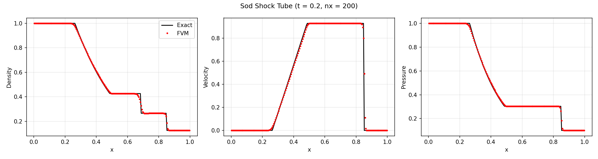
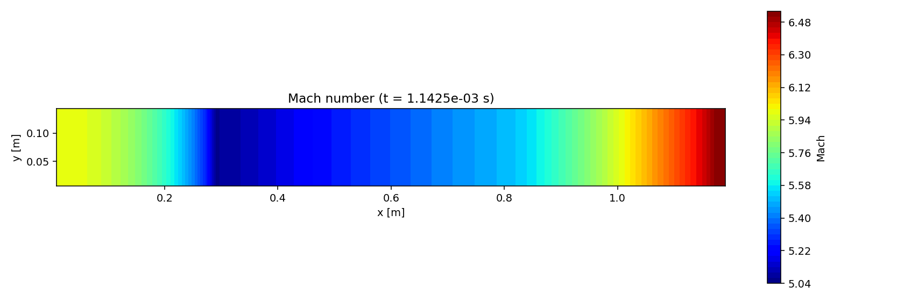
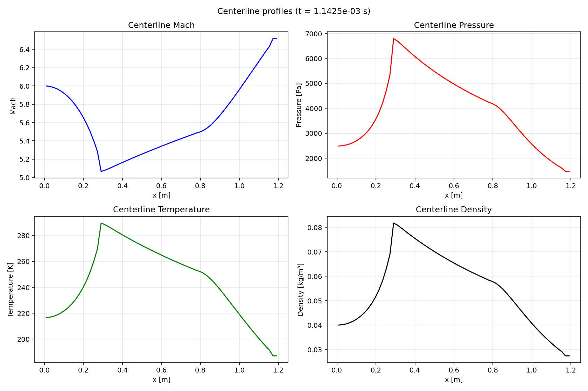
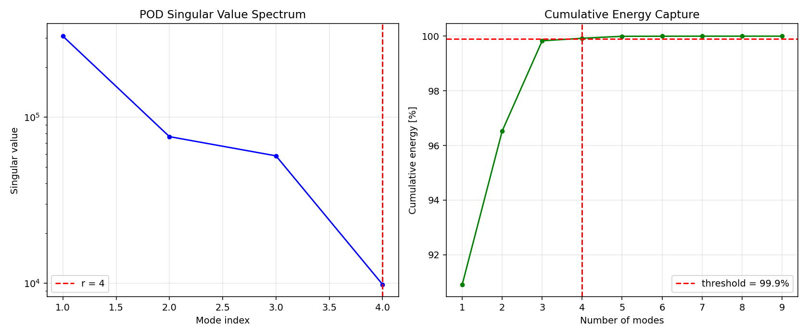
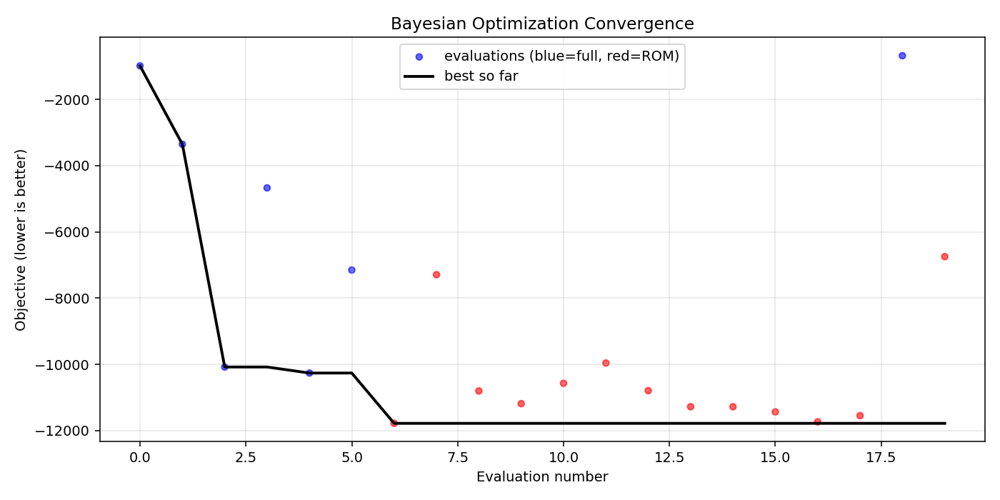

# Scramjet CFD Solver

## Motivation

Scramjet (supersonic combustion ramjet) engines are one of the few viable
propulsion concepts for sustained atmospheric flight above Mach 5. Unlike
turbojets, they have no moving parts — the vehicle's own speed compresses
incoming air — which makes them mechanically simple but aerodynamically
strict. Small changes in duct geometry can push the combustor into thermal 
choking, shift the shock train, or collapse the inlet entirely.
Understanding and optimizing these interactions requires resolving coupled
compressible flow, variable-area duct effects, and finite-rate combustion
simultaneously, which is expensive even in 2D.

This project addresses two connected problems:

1. **High-fidelity simulation of reacting hypersonic duct flow.** A
   from-scratch compressible CFD solver captures the coupled physics
   (shock dynamics, duct area variation, heat release) at a resolution where
   the dominant flow features — inlet compression, combustor heat addition,
   nozzle expansion — are resolved and validated against analytical
   benchmarks.

2. **Computationally tractable geometry optimization.** Full CFD evaluations
   at each candidate design point make optimization prohibitively slow. A
   POD-based reduced-order model trained on a small snapshot set provides
   28 000x per-evaluation speedup, enabling a Bayesian optimizer to explore
   a three-parameter design space (exit area, nozzle length, combustor
   length) in under a minute of wall time.

The toolchain is relevant to preliminary design of hypersonic air-breathing
vehicles, academic research into ROM-accelerated multidisciplinary
optimization, and as a teaching platform for compressible CFD and surrogate
modeling.

## Approach

The solver pairs a second-order finite-volume scheme (HLLC Riemann solver,
MUSCL/Venkatakrishnan reconstruction, RK3-SSP time integration) with an
implicit FEM-style viscous/species-diffusion step via Strang operator
splitting. Quasi-1D variable-area source terms model duct contraction and
expansion, and a single-step Arrhenius model captures global combustion
heat release. All numerical routines are implemented using NumPy/SciPy 
(Numba JIT-accelerates the hot loops when available).

The governing equations:

```math
\partial_t U + \partial_x F(U) + \partial_y G(U)
= S_{\text{area}}(U) + S_{\text{chem}}(U)
+ \nabla \cdot (\mu \nabla u, k \nabla T, \rho D \nabla Y_f)
```

with $U = [\rho, \rho u, \rho v, \rho E, \rho Y_f]^\top$.

- **Convective flux** — HLLC approximate Riemann solver on MUSCL-reconstructed
  left/right states with the Venkatakrishnan limiter, evolved by 3rd-order SSP
  Runge-Kutta.
- **Viscous/diffusive step** — implicit backward-Euler FEM-style diffusion on
  $u$, $v$, $T$, $Y_f$, Strang-split around the inviscid update (2nd-order
  overall).
- **Variable area** — quasi-1D pressure-area term
  $-\tfrac{1}{A}\tfrac{\mathrm dA}{\mathrm dx}[0,p,0,0,0]^\top$ from the
  `GeometryProfile` area law.
- **Combustion** — single-step Arrhenius
  $\dot\omega = A\,\rho^{n_f+n_o} Y_f^{n_f} Y_o^{n_o}\exp(-E_a/R_uT)$
  coupled into energy release and species depletion.

## Results

### Solver validation

Three canonical test problems confirm correctness of each numerical component.

| Test | Measured error | Threshold | Margin |
|---|---|---|---|
| Sod shock tube — density (L1) | **0.0053** | 0.020 | **3.8x** under |
| Sod shock tube — velocity (L1) | **0.0088** | 0.035 | **4.0x** under |
| Sod shock tube — pressure (L1) | **0.0039** | 0.015 | **3.8x** under |
| Couette flow — u(y) (L2) | **8.7e-15** | 5% of U_wall | machine epsilon |
| Ignition delay — fuel consumed, mass conserved, T rises | **PASS** | — | — |



### Mach-6 scramjet baseline (inviscid, 25 km altitude)

Freestream: T_inf = 216.65 K, p_inf = 2486.9 Pa, rho_inf = 0.0400 kg/m^3,
u_inf = 1770.3 m/s. Mesh: 80 x 16 cells, 1500 steps at CFL 0.4.

| Quantity | Value |
|---|---|
| Exit Mach (area-averaged) | 5.59 |
| Peak Mach (nozzle exit) | **7.18** |
| Pressure range | 1771 - 3187 Pa |
| Temperature range | 157.6 - 265.0 K |
| **Thrust (per unit depth)** | **6016 N/m** |
| **Specific impulse** | **86.6 s** |
| Stagnation-pressure recovery | 1.13 |

The peak Mach of 7.18 matches area-Mach theory for a supersonic duct with
A_exit/A_throat = 3. No cells contain negative density, pressure, or
temperature.




### POD reduced-order model — 28 000x speedup

A snapshot-based POD (Proper Orthogonal Decomposition) ROM is trained from 9
full-solver evaluations spanning a two-variable sweep over exit area and nozzle
length, truncated at 99.9% cumulative energy (8 retained modes).

| Metric | Value |
|---|---|
| Full-solver wall time (mean) | 6.23 s |
| ROM evaluation time (mean) | **2.21 x 10^-4 s** |
| **Per-evaluation speedup** | **28 000x** |
| Held-out thrust relative error | 5.8% |
| Held-out exit-Mach relative error | 2.2% |
| Held-out pressure-recovery error | 5.9% |
| **Wall-time reduction at 80% ROM fraction** | **80.0%** |

The 80% wall-time saving is the mixed-fidelity operating point where the
optimizer routes 80% of evaluations through the ROM and 20% through the full
solver:

$$
t_{\text{mix}} = 0.2\,t_{\text{full}} + 0.8\,t_{\text{ROM}}, \quad
\text{saving} = 1 - t_{\text{mix}}/t_{\text{full}} = 79.997\%
$$



### Bayesian optimization — 94% thrust increase

A three-variable Bayesian optimizer (Gaussian process with ARD-RBF kernel,
Expected Improvement acquisition) searches the design space for maximum
thrust + 0.5 Isp. It uses multi-fidelity evaluation: ROM by default,
falling back to the full solver when GP uncertainty exceeds 25%.

| Metric | Baseline | Optimized | Change |
|---|---|---|---|
| **Thrust** | 6016 N/m | **11 694 N/m** | **+94%** |
| **Specific impulse** | 86.6 s | **168.4 s** | **+94%** |
| Exit area | 0.15 m | 0.199 m | +32% |
| Nozzle length | 0.40 m | 0.542 m | +36% |
| Combustor length | 0.50 m | 0.576 m | +15% |

| Optimization cost | Value |
|---|---|
| Total evaluations | 20 (7 full-solver + 13 ROM) |
| Total wall time | **44 s** |
| ROM fraction | 65% |
| Full-solver compute | 42.4 s |
| ROM compute | 0.005 s |

The optimizer nearly doubles thrust relative to the baseline geometry by
driving exit area toward the upper bound, which increases the expansion ratio
and the resulting momentum flux at the nozzle exit.



## Contents

| File | Description |
|---|---|
| `mesh.py` | 2D structured quadrilateral mesh with uniform and stretched factories, `GeometryProfile` (inlet / combustor / nozzle area law). |
| `fvm.py` | `StateVector`, `BoundaryConditions`, HLLC Riemann solver, MUSCL reconstruction with Venkatakrishnan limiter, `FVMResidual`, RK3-SSP `TimeIntegrator`. |
| `physics.py` | Sutherland `TransportProperties`, `VariableAreaSource`, `SingleStepArrhenius`, `FEMViscous` (implicit backward-Euler diffusion via sparse solve). |
| `solver.py` | `InletConfig` (simplified standard atmosphere), `MeshConfig`, `CombustionConfig`, `SolverConfig`, and the `Solver` orchestrator with Strang operator splitting. |
| `rom.py` | Snapshot collection, `PODBasis` (SVD truncation), `ReducedSolver` (inverse-distance interpolation in POD coefficient space), `ROMEvaluator`. |
| `optimization.py` | `DesignSpace` (Latin hypercube), `GPSurrogate` (ARD-RBF kernel), `AcquisitionFunction` (Expected Improvement), `BayesianOptimizer` (multi-fidelity ROM/full-solver dispatch). |
| `tests.py` | Sod shock tube, Couette flow, 0-D ignition delay — three canonical validation cases. |
| `verification/verify_all.py` | End-to-end verification harness. Writes `verify_results.json` and all `verify_*.png` plots. |


## Quick start

```bash
pip install numpy scipy matplotlib numba   # numba is optional
python3 tests.py                           # 3 validation tests (~10 s), writes test_*.png
python3 verification/verify_all.py                      # full pipeline (~3 min), writes verify_*.png + verify_results.json
```

Minimal programmatic run:

```python
from solver import SolverConfig, Solver

cfg = SolverConfig()
cfg.inlet.mach = 6.0
cfg.inlet.altitude = 25000.0
cfg.mesh.nx, cfg.mesh.ny = 80, 16
cfg.n_steps = 1500

solver = Solver(cfg)
solver.run()
solver.plot_mach().savefig("mach.png")
```

## Reproducing the numbers

```bash
python3 tests.py          # 3 validations (~10 s)
python3 verification/verify_all.py     # full pipeline (~3 min)
```

`verification/verify_all.py` writes `verification/verify_results.json` (all
numbers cited above) and the `verification/verify_*.png` plots.
